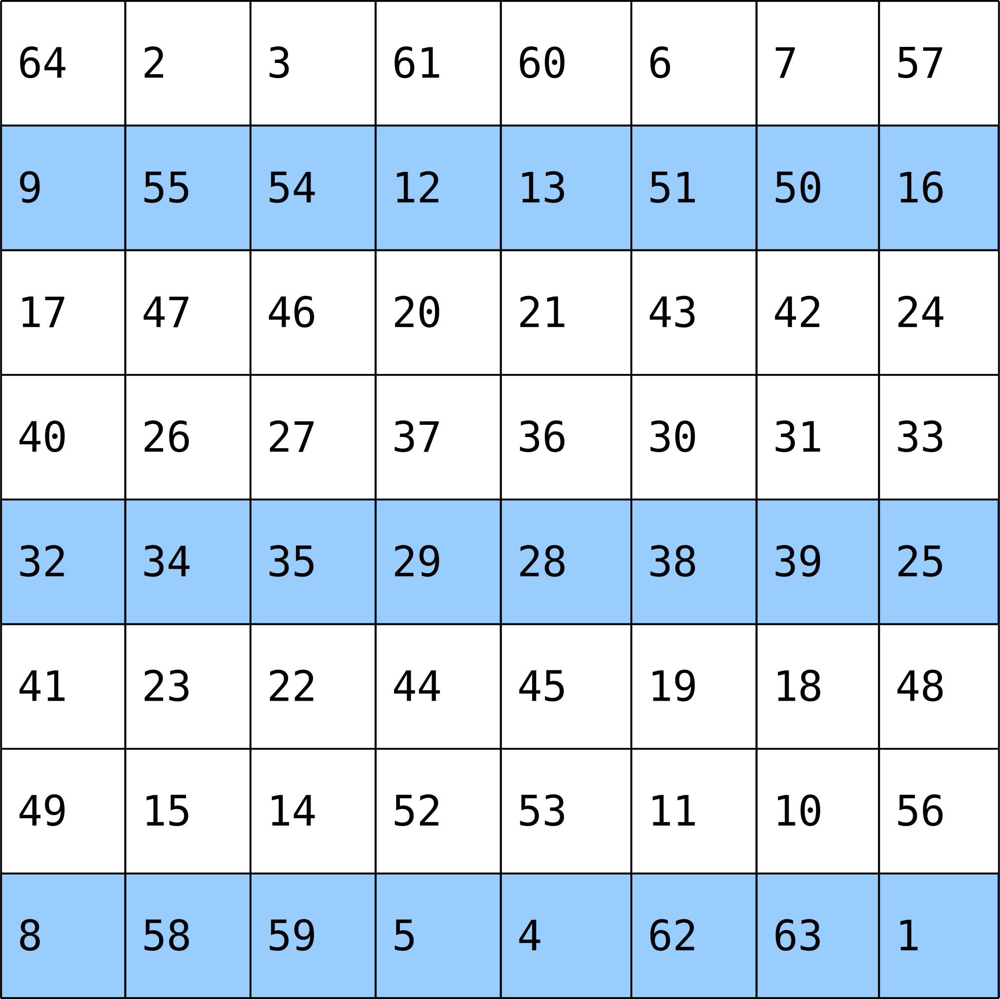
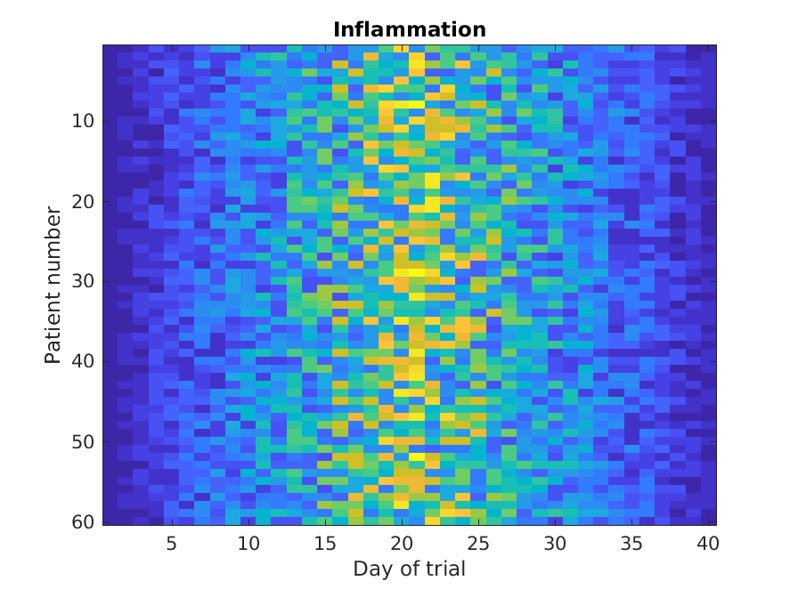
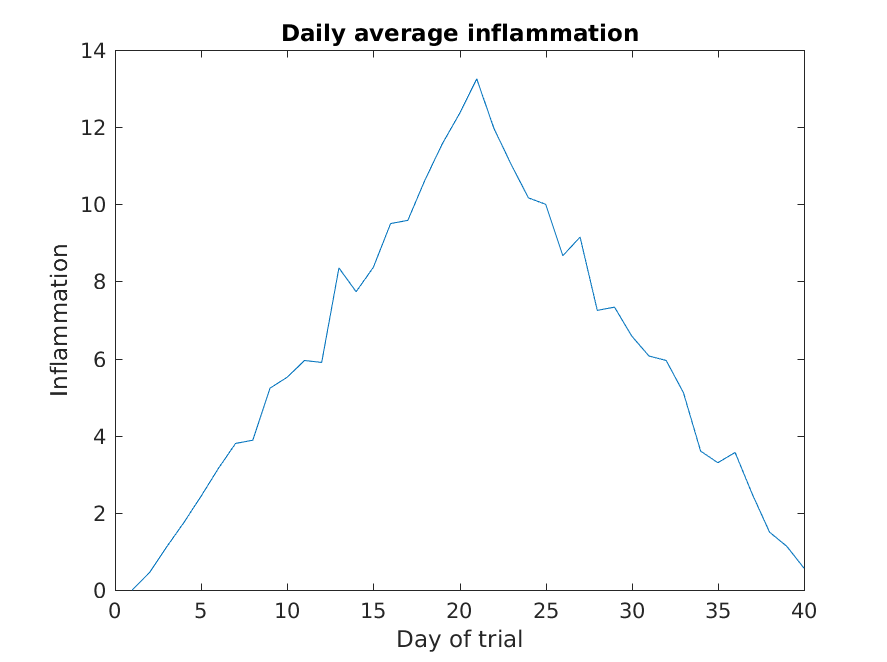
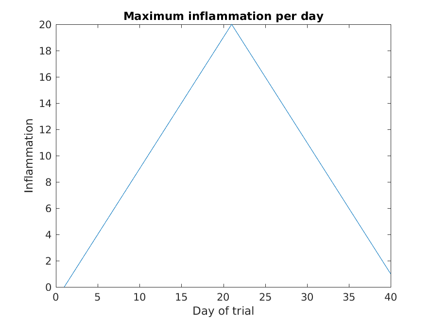
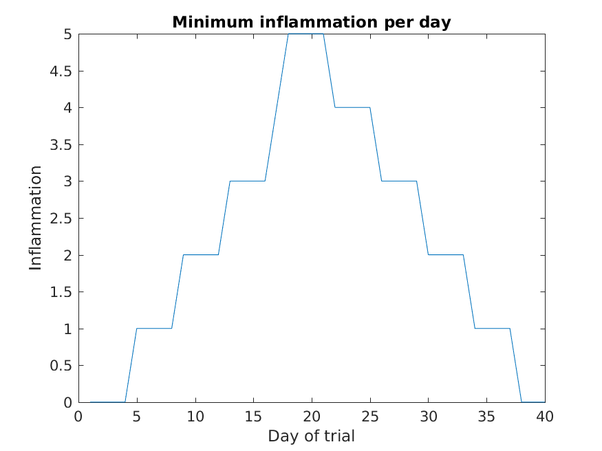

We are studying inflammation in patients who have been given a new treatment for arthritis,
and need to analyze the first dozen data sets.
The data sets are stored in
[Comma Separated Values (CSV)](../reference/index.html#comma-separated-values) format:
each row holds information for a single patient,
and the columns represent successive days.
The first few rows of our first file,
[`inflammation-01.csv`](../data/inflammation-01.csv), look like this:

~~~
0,0,1,3,1,2,4,7,8,3,3,3,10,5,7,4,7,7,12,18,6,13,11,11,7,7,4,6,8,8,4,4,5,7,3,4,2,3,0,0
0,1,2,1,2,1,3,2,2,6,10,11,5,9,4,4,7,16,8,6,18,4,12,5,12,7,11,5,11,3,3,5,4,4,5,5,1,1,0,1
0,1,1,3,3,2,6,2,5,9,5,7,4,5,4,15,5,11,9,10,19,14,12,17,7,12,11,7,4,2,10,5,4,2,2,3,2,2,1,1
0,0,2,0,4,2,2,1,6,7,10,7,9,13,8,8,15,10,10,7,17,4,4,7,6,15,6,4,9,11,3,5,6,3,3,4,2,3,2,1
0,1,1,3,3,1,3,5,2,4,4,7,6,5,3,10,8,10,6,17,9,14,9,7,13,9,12,6,7,7,9,6,3,2,2,4,2,0,1,1
~~~
{: .source}

We want to:

* load that data into memory,
* calculate the average inflammation per day across all patients, and
* plot the result.

To do all that, we'll have to learn a little bit about programming.

## Introduction to the MATLAB GUI
Before we can start programming, we need to know a little about the MATLAB interface.
Using the default setup, the MATLAB desktop contains several important sections:

* In the **Command Window** we can run and debug our code.
Everything that's typed into the command window is executed immediately.
* Alternatively, we can open the **Editor**, write our code and run it all at once.
The upside of this is that
we can save our code and run it again in the same way at a later stage.
* The **Workspace** contains all the variables which we have loaded into memory.
* The **Current Folder** window shows files in the current directory,
  and we can change the current folder using this window.
* **Search Documentation** on the top right of your screen lets you search for functions.
Suggestions for functions that would do what you want to do will pop up.
Clicking on them will open the documentation.
Another way to access the documentation is via the `help` command --- we will return to this later.

## Good practices for project organisation
Before we get started, let's create some directories to help organise this project.

> ## Tip: Good Enough Practices for Scientific Computing
>
> [Good Enough Practices for Scientific Computing](https://swcarpentry.github.io/good-enough-practices-in-scientific-computing/)
> gives the following recommendations for project organization:
>
> 1. Put each project in its own directory, which is named after the project.
> 2. Put text documents associated with the project in the `doc` directory.
> 3. Put raw data and metadata in the `data` directory, and files generated during clean-up and analysis in a `results` directory.
> 4. Put source code for the project in the `src` directory,
>    and programs brought in from elsewhere or compiled locally in the `bin` directory.
> 5. Name all files to reflect their content or function.
>
{: .callout}

We already have a `data` directory in our `matlab-novice-inflammation` project directory,
so we only need to create a `results` directory for this project.
You can use your computer's file browser to create this directory.
We'll save all our scripts and function files in the main project directory.

A final step is to set the *current folder* in MATLAB to our project folder.
Use the **Current Folder** window in the MATLAB GUI to browse to your project folder
(`matlab-novice-inflammation`).

In order to check the current directory, we can run `pwd` to print the working directory.
A second check we can do is to run the `ls` command in the Command Window ---
we should get the following output:

```
data   results
```
{: .matlab}


Reading data from files and writing data to them
are essential tasks in scientific computing,
and admittedly,
something that we'd rather not spend a lot of time thinking about.
Fortunately, MATLAB comes with a number of high-level tools to do these things efficiently,
sparing us the grisly detail.

If we know what our data looks like (in this case, we have comma-separated values)
and we're unsure about what command we want to use,
we can search the documentation.
Type `read csv` into the documentation toolbar.
MATLAB suggests using `csvread`.
If we have a closer look at the documentation,
MATLAB also tells us, which in- and output arguments this function has.

To load the data from our CSV file into MATLAB, type the following
command into the MATLAB command window, and press `Enter`:

~~~
csvread('data/inflammation-01.csv')
~~~
{: .matlab}

You should see a wall of numbers on the screen---these are the values
from the CSV file.
It can sometimes
be useful to see the output from MATLAB commands, but it is often not.
To suppress the
output, simply put a semicolon at the end of your command:

~~~
csvread('data/inflammation-01.csv');
~~~
{: .matlab}

The expression `csvread(...)` is a
[function call](../reference/index.html#function-call).
Functions generally need [arguments](../reference/index.html#arguments)
to run.
In the case of the `csvread` function, we need to provide a single
argument: the name of the file we want to read data from. This
argument needs to be a character string or
[string](../reference/index.html#string), so we put it in quotes.

Our call to `csvread` read our file, and printed the data inside
to the screen. And adding a semicolon rendered it even less useful---
we have no way to modify those values
or compute with them. To do that, we need to assign the array to a
[variable](../reference/index.html#variable).

~~~
patient_data = csvread('data/inflammation-01.csv');
~~~
{: .matlab}

A variable is just a name for a piece of data or *value*.
Variable names must begin with a letter, and can contain
numbers or underscores. Examples of valid variable names are
`x`, `f_0` or `current_temperature`.

We can create a new variable simply by assigning a value to it using
`=`:

~~~
weight_kg = 55;
~~~
{: .matlab}

Once a variable has a value, we can print it using the `disp` function:

~~~
disp(weight_kg)
~~~
{: .matlab}

~~~
55
~~~
{: .output}

or simply typing its name, followed by <kbd>Enter</kbd>

```
weight_kg
```
{: .matlab}

```
w =
    55
```
{: .output}

and do arithmetic with it:

~~~
weight_lb = 2.2 * weight_kg;
disp(['Weight in pounds: ', num2str(weight_lb)])
~~~
{: .matlab}

~~~
Weight in pounds: 121
~~~
{: .output}

The `disp` function takes a single argument -- the value to print. To
print more than one value on a single line, we could print an *array*
of values. All values in this array need to be the same type. So, if
we want to print a string and a numerical value together, we *have* to
convert that numerical value to a string with the `num2str` function.

Assignment is giving a name to a value so that it can be used again,
and accessed by other parts of a program.

Assigning a value to one variable does not change the values of other
variables.
For example,

~~~
weight_kg = 57.5;
weight_lb = 2.2 * weight_kg;
disp(['Weight in kg: ', num2str(weight_kg)])
disp(['Weight in pounds: ', num2str(weight_lb)])
~~~
{: .matlab}

~~~
Weight in kg: 57.5
Weight in pounds: 126.5
~~~
{: .output}


Let's update the value of one of our variables, and print the values
of both:

~~~
weight_kg = 100;
disp(['Weight in kg: ', num2str(weight_kg)])
disp(['Weight in pounds: ', num2str(weight_lb)])
~~~
{: .matlab}

~~~
Weight in kg: 100
Weight in pounds: 126.5
~~~
{: .output}

Since `weight_lb` doesn't "remember" where its value came from, it isn't
automatically updated when `weight_kg` changes. This is important to
remember, and different from the way spreadsheets work.

Now that we know how to assign values to variables, let's
view a list of all the variables in our workspace:

~~~
who
~~~
{: .matlab}

~~~
Your variables are:

patient_data  weight_kg  weight_lb
~~~
{: .output}

To remove a variable from MATLAB, use the `clear` command:

~~~
clear weight_lb
who
~~~
{: .matlab}


~~~
Your variables are:

patient_data  weight_kg
~~~
{: .output}

Alternatively, we can look at the **Workspace**.
The workspace contains all variable names and assigned values that we currently work with.
As long as they pop up in the workspace,
they are universally available.
It's generally a good idea to keep the workspace as clean as possible.
To remove all variables from the workspace, execute the command `clear all`.

> ## Predicting Variable Values
>
> Predict what variables refer to what values after each statement in the following program:
>
> ~~~
> mass = 47.5
> age = 122
> mass = mass * 2.0
> age = age - 20
> ~~~
> {: .matlab}
{: .challenge}

Now that our data is in memory, we can start doing things with it.
First, let's find out its [size](../reference/index.html#size):

~~~
size(patient_data)
~~~
{: .matlab}

~~~
ans =

    60 40
~~~
{: .output}

The output tells us that the variable `patient_data`
refers to a table of values
that has 60 rows and 40 columns.

MATLAB stores *all* data in the form of multi-dimensional arrays. For example:

* Numbers, or *scalars* are represented as two dimensional arrays with only one row and one column, as are single characters. 
* Lists of numbers, or *vectors* are two dimensional as well, but the value of one of the dimensions equals one.
  By default vectors are row vectors, meaning they have one row and as many columns as there are elements in the vector.
* Tables of numbers, or *matrices* are arrays with more than one column and more than one row.
* Even character strings, like sentences, are stored as an "array
of characters".

Normally, MATLAB arrays can't store elements of different data types. For
instance, a MATLAB array can't store both a `float` and a `char`. To do that,
you have to use a [Cell Array](http://www.mathworks.com/help/matlab/cell-arrays.html).

We can use the `class` function to find out what kind of data lives
inside an array:

~~~
class(patient_data)
~~~
{: .matlab}

~~~
ans = double
~~~
{: .output}

This output tells us that `patient_data` refers to an array of
double precision floating-point numbers. This is the default numeric
data type in MATLAB. If you want to store other numeric data types,
you need to tell MATLAB explicitly. For example, the command,

~~~
x = int16(325);
~~~
{: .matlab}


assigns the value `325` to the name `x`, storing it as a 16-bit signed
integer.

Let's create an 8-by-8 "magic" Matrix:

~~~
M = magic(8)
~~~
{: .matlab}

~~~
ans =

   64    2    3   61   60    6    7   57
    9   55   54   12   13   51   50   16
   17   47   46   20   21   43   42   24
   40   26   27   37   36   30   31   33
   32   34   35   29   28   38   39   25
   41   23   22   44   45   19   18   48
   49   15   14   52   53   11   10   56
    8   58   59    5    4   62   63    1
~~~
{: .output}

We want to access a single value from the matrix:


To do that, we must provide
its [index](../reference/index.html#index) in parentheses:

~~~
M(5, 6)
~~~
{: .matlab}

~~~
ans = 38
~~~
{: .output}

Indices are provided as (row, column). So the index `(5, 6)` selects the element
on the fifth row and sixth column.

An index like `(5, 6)` selects a single element of
an array, but we can also access sections of the matrix, or [slices](../reference/index.html#slice).
To access a row of values:


we can do:

~~~
M(5, :)
~~~
{: .matlab}

~~~
ans =

   32   34   35   29   28   38   39   25

~~~
{: .output}

Providing `:` as the index for a dimension selects *all* elements
along that dimension.
So, the index `(5, :)` selects
the elements on row `5`, and *all* columns---effectively, the entire row.
We can also
select multiple rows,


~~~
M(1:4, :)
~~~
{: .matlab}

~~~
ans =

   64    2    3   61   60    6    7   57
    9   55   54   12   13   51   50   16
   17   47   46   20   21   43   42   24
   40   26   27   37   36   30   31   33
~~~
{: .output}

and columns:


~~~
M(:, 6:end)
~~~
{: .matlab}

~~~
ans =

    6    7   57
   51   50   16
   43   42   24
   30   31   33
   38   39   25
   19   18   48
   11   10   56
   62   63    1
~~~
{: .output}

To select a submatrix,


we have to take slices in both dimensions:

~~~
M(4:6, 5:7)
~~~
{: .matlab}

~~~
ans =

   36   30   31
   28   38   39
   45   19   18

~~~
{: .output}

We don't have to take all the values in the slice---if we provide
a [stride](../reference/index.html#stride). Let's say we want to start with row `2`,
and subsequently select every third row:



~~~
M(2:3:end, :)
~~~
{: .matlab}

~~~
ans =

    9   55   54   12   13   51   50   16
   32   34   35   29   28   38   39   25
    8   58   59    5    4   62   63    1
~~~
{: .output}

And we can also select values in a "checkerboard",


by taking appropriate strides in both dimensions:

~~~
M(1:3:end, 2:2:end)
~~~
{: .matlab}

~~~
ans =

    2   61    6   57
   26   37   30   33
   15   52   11   56
~~~
{: .output}

> ## Slicing
>
> A subsection of an array is called a [slice](../reference/index.html#slice). We can take slices of character strings as well:
>
> ~~~
> element = 'oxygen';
> disp(['first three characters: ', element(1:3)])
> disp(['last three characters: ', element(4:6)])
> ~~~
> {: .matlab}
>
> ~~~
> first three characters: oxy
> last three characters: gen
> ~~~
> {: .output}
>
> 1. What is the value of `element(4:end)`? What about `element(1:2:end)`? Or `element(2:end - 1)`?
>
> 2. For any size array, MATLAB allows us to index with a single colon operator (`:`).
>    This can have surprising effects.
>    For instance, compare `element` with `element(:)`. What is `size(element)` versus `size(element(:))`?
>    Finally,
>    try using the single colon on the matrix `M` above: `M(:)`.
>    What seems to be happening when we use the single colon operator for slicing?
{: .challenge}

Now that we know how to access data we want to compute with,
we're ready to analyze `patient_data`.
MATLAB knows how to perform common mathematical operations on arrays.
If we want to find the average inflammation for all patients on all days,
we can just ask for the mean of the array:

~~~
mean(patient_data(:))
~~~
{: .matlab}

~~~
ans = 6.1487
~~~
{: .output}

We couldn't just do `mean(patient_data)` because, that
would compute the mean of *each column* in our table, and return an array
of mean values. The expression `patient_data(:)` *flattens* the table into a
one-dimensional array.

To get details about what a function, like `mean`,
does and how to use it, we can search the documentation, or use MATLAB's `help` command.

~~~
help mean
~~~
{: .matlab}

~~~
mean   Average or mean value.
    S = mean(X) is the mean value of the elements in X if X is a vector. 
    For matrices, S is a row vector containing the mean value of each 
    column. 
    For N-D arrays, S is the mean value of the elements along the first 
    array dimension whose size does not equal 1.
 
    mean(X,DIM) takes the mean along the dimension DIM of X.
 
    S = mean(...,TYPE) specifies the type in which the mean is performed, 
    and the type of S. Available options are:
 
    'double'    -  S has class double for any input X
    'native'    -  S has the same class as X
    'default'   -  If X is floating point, that is double or single,
                   S has the same class as X. If X is not floating point, 
                   S has class double.
 
    S = mean(...,NANFLAG) specifies how NaN (Not-A-Number) values are 
    treated. The default is 'includenan':
 
    'includenan' - the mean of a vector containing NaN values is also NaN.
    'omitnan'    - the mean of a vector containing NaN values is the mean 
                   of all its non-NaN elements. If all elements are NaN,
                   the result is NaN.
 
    Example:
        X = [1 2 3; 3 3 6; 4 6 8; 4 7 7]
        mean(X,1)
        mean(X,2)
 
    Class support for input X:
       float: double, single
       integer: uint8, int8, uint16, int16, uint32,
                int32, uint64, int64
 
    See also median, std, min, max, var, cov, mode.
~~~
{: .output}

We can also compute other statistics, like the maximum, minimum and
standard deviation.

~~~
disp(['Maximum inflammation: ', num2str(max(patient_data(:)))])
disp(['Minimum inflammation: ', num2str(min(patient_data(:)))])
disp(['Standard deviation: ', num2str(std(patient_data(:)))])
~~~
{: .matlab}

~~~
Maximum inflammation: 20
Minimum inflammation: 0
Standard deviation: 4.6148
~~~
{: .output}

When analyzing data, though, we often want to look at partial statistics,
such as the maximum value per patient or the average value per day.
One way to do this is to assign the data we want to a new temporary
array, then ask it to do the calculation:

~~~
patient_1 = patient_data(1, :)
disp(['Maximum inflation for patient 1: ', num2str(max(patient_1))])
~~~
{: .matlab}

~~~
Maximum inflation for patient 1: 18
~~~
{: .output}

We don't actually need to store the row in a variable of its own.
Instead, we can combine the selection and the function call:

~~~
max(patient_data(1, :))
~~~
{: .matlab}

~~~
ans = 18
~~~
{: .output}

What if we need the maximum inflammation for *all* patients, or the
average for each day?
As the diagram below shows, we want to perform the operation across an
axis:


To support this, MATLAB allows us to specify the *dimension* we
want to work on. If we ask for the average across the dimension 1,
we get:

~~~
mean(patient_data, 1)
~~~
{: .matlab}

~~~
ans =

 Columns 1 through 13:

    0.00000    0.45000    1.11667    1.75000    2.43333    3.15000    3.80000    3.88333    5.23333    5.51667    5.95000    5.90000    8.35000

 Columns 14 through 26:

    7.73333    8.36667    9.50000    9.58333   10.63333   11.56667   12.35000   13.25000   11.96667   11.03333   10.16667   10.00000    8.66667

 Columns 27 through 39:

    9.15000    7.25000    7.33333    6.58333    6.06667    5.95000    5.11667    3.60000    3.30000    3.56667    2.48333    1.50000    1.13333

 Column 40:

    0.56667

~~~
{: .output}

As a quick check, we can check the size of this array:

~~~
size(mean(patient_data, 1))
~~~
{: .matlab}

~~~
ans =
    1    40
~~~
{: .output}

The size tells us we have a 1-by-40 vector, so this is the average
inflammation per day for all patients. If we average across axis 2, we
get:

~~~
mean(patient_data, 2)
~~~
{: .matlab}

~~~
ans =

   5.4500
   5.4250
   6.1000
   5.9000
   5.5500
   6.2250
   5.9750
   6.6500
   6.6250
   6.5250
   6.7750
   5.8000
   6.2250
   5.7500
   5.2250
   6.3000
   6.5500
   5.7000
   5.8500
   6.5500
   5.7750
   5.8250
   6.1750
   6.1000
   5.8000
   6.4250
   6.0500
   6.0250
   6.1750
   6.5500
   6.1750
   6.3500
   6.7250
   6.1250
   7.0750
   5.7250
   5.9250
   6.1500
   6.0750
   5.7500
   5.9750
   5.7250
   6.3000
   5.9000
   6.7500
   5.9250
   7.2250
   6.1500
   5.9500
   6.2750
   5.7000
   6.1000
   6.8250
   5.9750
   6.7250
   5.7000
   6.2500
   6.4000
   7.0500
   5.9000
~~~
{: .output}

which is the average inflammation per patient across
all days.

The mathematician Richard Hamming once said,
"The purpose of computing is insight, not numbers," and the best
way to develop insight is often to visualize data. Visualization
deserves an entire lecture (or course) of its own, but we can
explore a few features of MATLAB here.

Let's display a heat map of our data:

~~~
imagesc(patient_data)
title('Inflammation')
xlabel('Day of trial')
ylabel('Patient number')
~~~
{: .matlab}



The `imagesc` function represents the matrix as a color image. Every
value in the matrix is *mapped* to a color. Blue regions in this heat map
are low values, while yellow shows high values.
As we can see,
inflammation rises and falls over a 40 day period.

It's good practice to give the figure a `title`,
and to label the axes using `xlabel` and `ylabel`
so that other people can understand what it shows
(including us if we return to this plot 6 months from now).

Let's take a look at the average inflammation over time:

~~~
ave_inflammation = mean(patient_data, 1);
plot(ave_inflammation)
title('Daily average inflammation')
xlabel('Day of trial')
ylabel('Inflammation')
~~~
{: .matlab}



Here, we have put the average per day across all patients in the
variable `ave_inflammation`, then used the `plot` function to display
a line graph of those values.
The result is roughly a linear rise and fall,
which is suspicious:
based on other studies, we expect a sharper rise and slower fall.
Let's have a look at two other statistics: the maximum and minimum
inflammation per day across all patients.

~~~
plot(max(patient_data, [], 1))
title('Maximum inflammation per day')
title('Daily average inflammation')
ylabel('Inflammation')
xlabel('Day of trial')
~~~
{: .matlab}



~~~
plot(min(patient_data, [], 1))
title('Minimum inflammation per day')
ylabel('Inflammation')
xlabel('Day of trial')
~~~
{: .matlab}



Like `mean()`, the functions
`max()` and `min()` can also operate across a specified dimension of
the matrix. However, the syntax is slightly different. To see why,
run a `help` on each of these functions.

From the figures, we see that the maximum value rises and falls perfectly
smoothly, while the minimum seems to be a step function. Neither result
seems particularly likely, so either there's a mistake in our
calculations or something is wrong with our data.

> ## Plots
>
> When we plot just one variable using the `plot` command e.g. `plot(Y)` 
> what do the x-values represent?
>
> > ## Solution
> > The x-values are the indices of the y-data, so the first y-value is plotted
> > against index 1, the second y-value against 2 etc.
> {: .solution}
>
> Why are the vertical lines in our plot of the minimum inflammation per day 
> not perfectly vertical?
>
> > ## Solution
> > MATLAB interpolates between the points on a 2D line plot.
> {: .solution}
>
> Create a plot showing the standard deviation of the inflammation data for each day across all patients.
> Hint: search the documentation for *standard deviation*
>
> > ## Solution
> > ```
> > plot(std(patient_data, 0, 2))
> > xlabel('Day of trial')
> > ylabel('Inflammation')
> > title('Standard deviation across all patients')
> > ```
> > {: .language-matlab}
> {: .solution}
{: .challenge}

It's common to put multiple figures "side-by-side" in a single
window for presentation and convenience. Here's how to use
the `subplot` function to do this:

~~~
subplot(1, 2, 1)
plot(max(patient_data, [], 1))
ylabel('max')

subplot(1, 2, 2)
plot(min(patient_data, [], 1))
ylabel('min')
~~~
{: .matlab}


Our work so far has convinced us that something is wrong with our
first data file. We would like to check the other 11 the same way,
but typing in the same commands repeatedly is tedious and error-prone.
Since computers don't get bored (that we know of), we should create a
way to do a complete analysis with a single command, and then figure out
how to repeat that step once for each file. These operations are the
subjects of the next two lessons.
